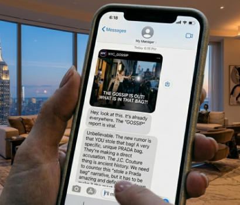

You see that your manager texted you: "There's a trending rumor about YOU!" You decide to address the rumor. Which statement are you choosing to publish?

[Option 1: I want to address the recent rumors directly. I take full responsibility.](apology-statement.md)

[Option 2: These rumors are so fake. I refuse to apologize. Please believe what you want, I don't care!](defensive-statements.md)

